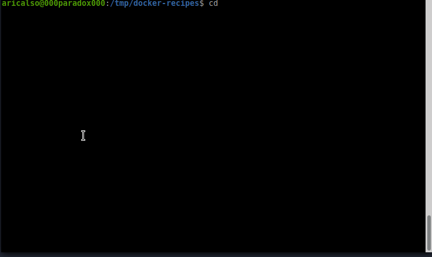

# Personal Recipes of Docker &rarr; Debian Latest &rarr; PySide2 App
[Back](../../../README.md)

## Description

Simple container with an entry point that runs a PySide2 app.

## How to run this recipe

There are various options to run this recipe, you can use any of them.

Using make:

```shell
cd recipes/debian-latest/pyside2-app
make run
```

Using docker cli:

```shell
cd recipes/debian-latest/pyside2-app
docker build -t recipes_debian_latest_pyside2_app_image .
xhost +
docker run --rm -t \
    -v "$(PWD)/src:/opt/src" \
    -v "/tmp/.X11-unix:/tmp/.X11-unix" \
    -e "DISPLAY=$(DISPLAY)" \
    recipes_debian_latest_pyside2_app_image
docker image rm recipes_debian_latest_pyside2_app_image
```

Using docker compose:

```shell
cd recipes/debian-latest/pyside2_app
docker-compose up
docker-compose down --rmi all -v --remove-orphans
```

## See it in action




