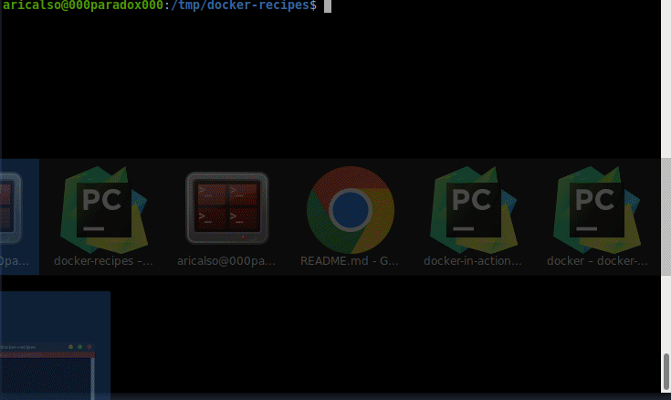

# Personal Recipes of Docker &rarr; Ubuntu Latest &rarr; Hello World
[Back](../../../README.md)

## Description

Simple container with an entry point that outputs the contents of a text file 
in console.

## How to run this recipe

There are various options to run this recipe, you can use any of them.

Using make:

```shell
cd recipes/ubuntu-latest/hello-world
make run
```

Using docker cli:

```shell
cd recipes/ubuntu-latest/hello-world
docker build -t docker_recipes_recipes_debian_latest_hello_world .
docker run --rm -t docker_recipes_recipes_debian_latest_hello_world
docker image rm docker_recipes_recipes_debian_latest_hello_world
```

Using docker compose:

```shell
cd recipes/ubuntu-latest/hello-world
docker-compose up
docker-compose down --rmi all -v --remove-orphans
```

## See it in action




